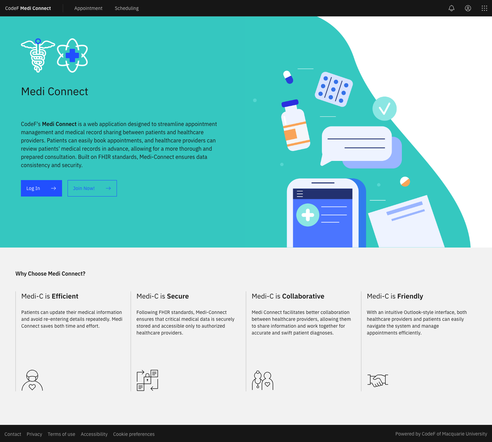
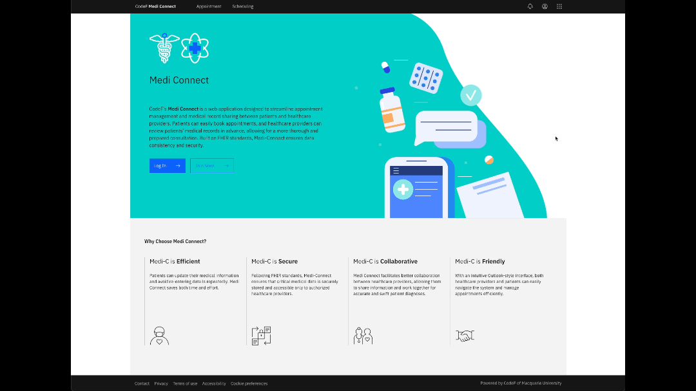
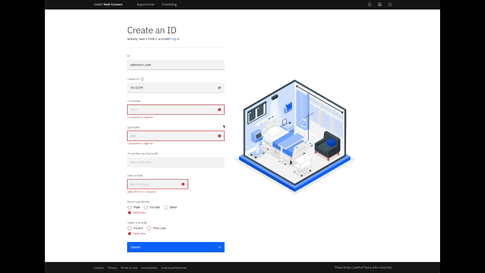
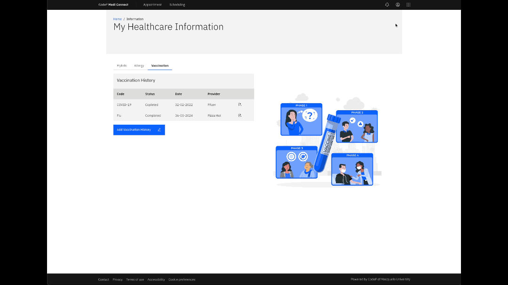
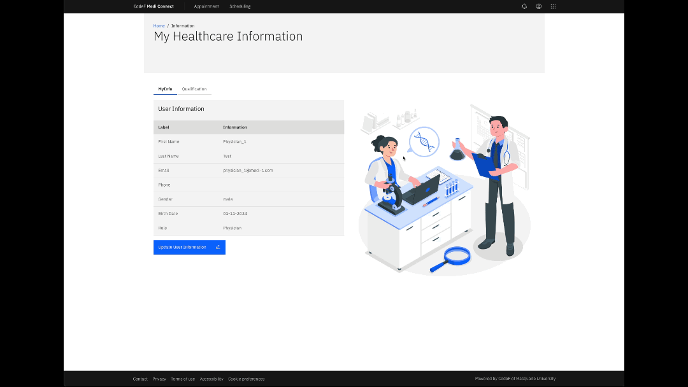
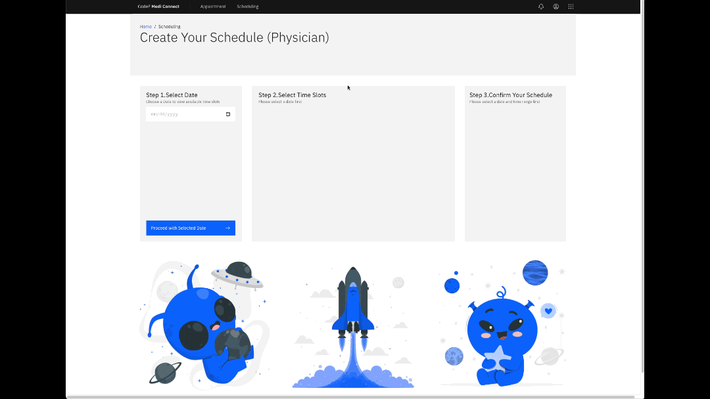
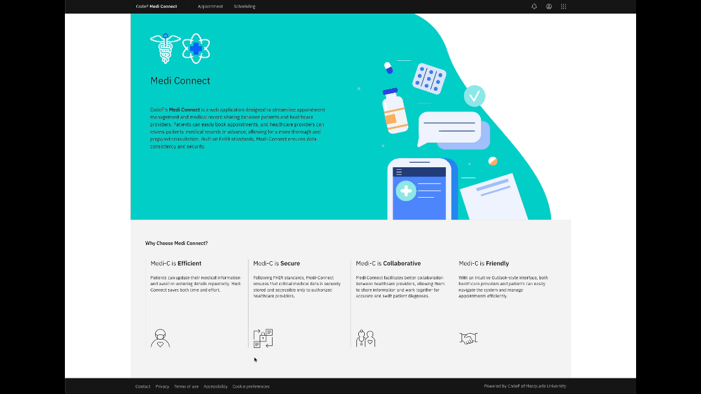
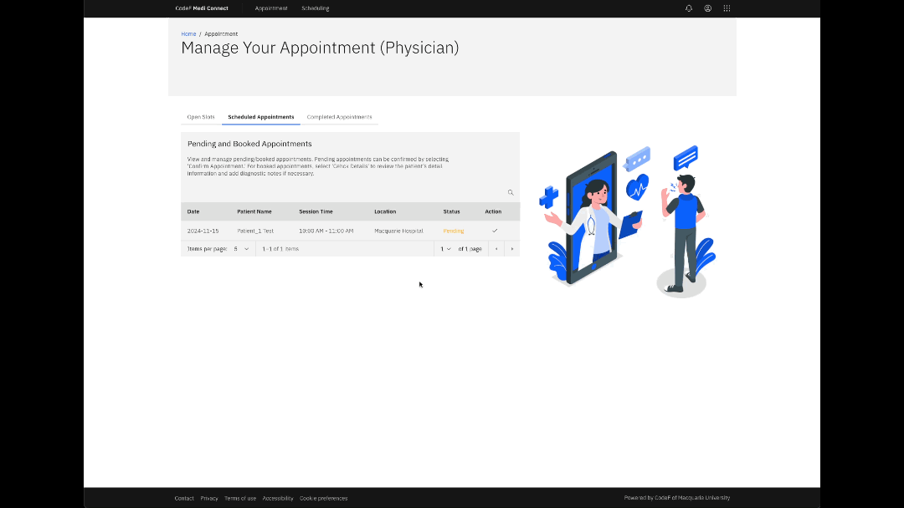
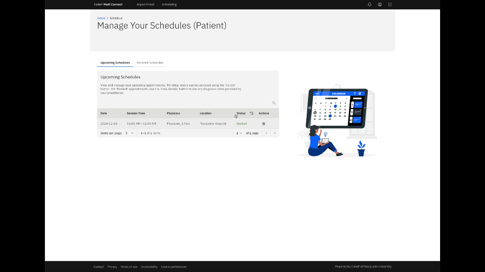
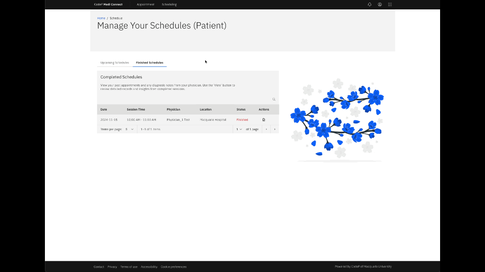

# Medi-Connect Feature Demonstration

This guide introduces the key features of the Medi-connect platform. Medi-connect focuses on streamlining the appointment system between patients and physicians, simplifying interactions effectively, and emphasizing usability and a robust workflow.

Author: Himchan Bae

## Feature Overview

Known Issue: Currently, there is a bug where the time stored by Carbon's Date Picker differs from the client's local time and AST (Atlantic Standard Time), leading to occasional discrepancies in schedule dates.

---

### Landing Page

Upon accessing Medi-connect, users are greeted with the landing page. This page includes a brief introduction to Medi-connect and an information section for further exploration. The landing page also provides buttons for 'Log In' and 'Join Now', making it easy for users to get started quickly. The header also includes 'Scheduling' and 'Appointment' links, which become accessible after logging in. These links allow users to navigate to the scheduling and appointment pages.

---

### Responsive Design

All pages in Medi-connect are designed with responsiveness in mind. As shown above, the layout adjusts seamlessly across different screen sizes, and users can easily navigate through the left-side menu panel.

---

### User Registration Process

The registration page can be accessed through the user menu in the global header and "Join Now" button in the landing page. Security is prioritized with complex password validation, and users can toggle the visibility of their passwords. Usernames must follow the @medi-c.com format, and all required fields (except the optional phone number) must be filled in for successful registration. If any required information is missing, error messages guide users to complete the input correctly.

---

### Login Process

Users can access the login page through the 'Log In' button on the landing page, the registration page, or the user menu. The login form requires the user's email and password, which can be toggled for visibility.

---

### Patient Updating Information Management

Patients can update their information through the 'My Healthcare Information' page. They can modify personal details, review allergy or vaccination information, and create new allergy or vaccination records. All fields are mandatory, except for the note field (which can only be modified by the physician, while patients have read-only access). Existing allergy/vaccine records can only be updated by physicians, and deletion is only available by admin.

---

### Physician Updating Information Management

Users can conveniently log out via the global user menu, and their credentials are verified securely with a password toggle option. Physicians can also update personal information and add medical qualifications. However, modifications or deletions of qualifications can only be performed by admin.

---

### Physician Creating Schedule Slots Process

Physicians can navigate back to the main screen using the breadcrumb feature. Upon selecting a desired date, detailed schedule information can be input. Start and end times are validated to ensure correct input (e.g., end time cannot be earlier than start time). Once a session duration is chosen, schedule slots are automatically generated. Break times are optional, and error handling ensures they fit appropriately within session timings. Additionally, it is verified that break times fall within session timings, and schedule slots are automatically calculated excluding break times.

---

### Physician Managing Appointments Process

Physicians can view all available (unbooked) schedule slots they have created and delete them if needed in "Open Slots" tap. The appointment list can be customized via pagination, search, and sorting features. Although the video does not show this, appointments can be sorted. As there are no booked appointments yet, slots for Pending/Booked/Finished states are not displayed in "scheduled Appointment" and "Completed Appointment" tap.

---

### Patient Managing Appointments Process

Patients can schedule appointments by selecting available slots from the "Appointment" page for a particular date. The appointment process is divided into three steps: selecting the date, selecting the time slot, and confirming the appointment details. The appointment table offers pagination, search, and sorting capabilities, allowing patients to easily find the desired time slot. Once booked, the appointment appears on the "Scheduling" page in a Pending state, and patients can cancel appointments if needed. The confirmation step provides a detailed summary, including the physician's name, location, and session time, ensuring patients can review all the relevant information before confirming.

---

### Physician Updating Diagnosis Process

Once a patient has booked a slot, physicians can see the new Pending appointment in their "Appointment" page. Physicians can view patient information, including general details, allergies, and vaccinations. They can also add or update diagnosis notes for allergies and vaccinations to ensure accurate medical records. Upon confirming the appointment, its status changes to Booked.

---

### Patient Checking Diagnosis Process

Patients can view the diagnosis notes left by their physician for any Booked appointment. The 'My Medical History' pop-up window provides a detailed overview of allergies and vaccinations. This ensures patients have access to a full summary of their medical history in a structured manner.

---

### Physician Finishing Appointments Process

Physicians can mark Booked appointments as Finished once the consultation is completed. Completed appointments can also be viewed under the 'Completed Appointments' tab. Completed appointments are locked from further diagnosis updates, and only the "View" option is available.

---

### Patient Reviewing Finished Appointments Process

Patients can also review the diagnosis notes for appointments marked as Finished in "Finished schedules tap, ensuring transparency and proper follow-up for their healthcare needs.
